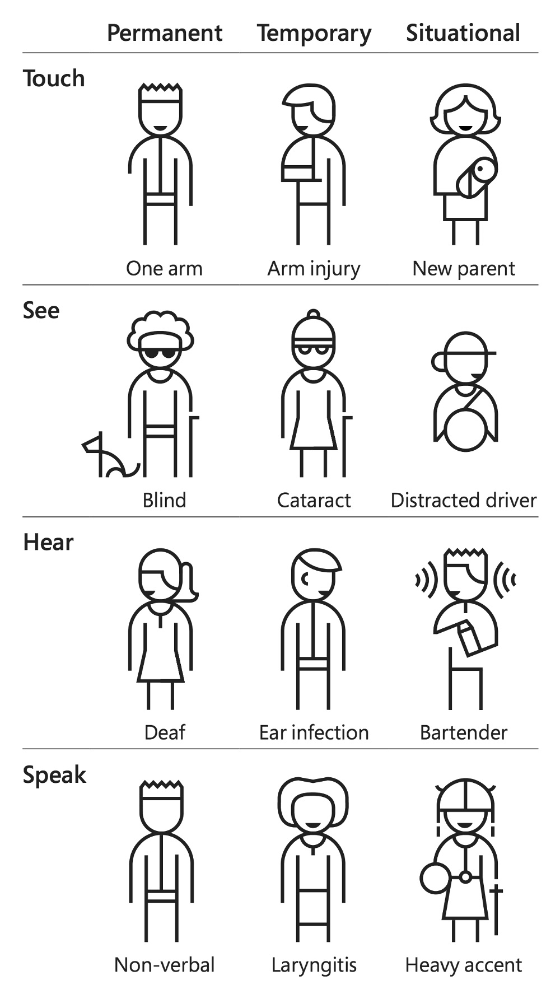

A list of different types of constraints and the potential impact as a designer and developer.

## List of types

### Blind

#### Description

Complete or near-complete loss of visual perception.

#### Impact

Implementing proper screen reader compatibility ensures blind users can navigate and understand web content.

### Low Vision

#### Description

Significant visual impairment that cannot be fully corrected with glasses or contact lenses.

#### Impact

Providing text resizing options and maintaining good contrast ratios can greatly improve usability for low vision users.

### Color-blind

#### Description

Difficulty distinguishing between certain colors, most commonly red and green.

#### Impact

Using color combinations that are distinguishable to color-blind users and not relying solely on color to convey information can ensure equal access to content.

### Deaf

#### Description

Severe to profound hearing loss.

#### Impact

Providing captions for audio content and visual alternatives for audio cues allows deaf users to access all information.

### Deafblind

#### Description

Combined hearing and vision loss.

#### Impact

Ensuring content is perceivable through multiple senses and compatible with assistive technologies like refreshable Braille displays is crucial.

### Motor Disabilities

#### Description

Limitations in muscle control or movement, including paralysis.

#### Impact

Designing for keyboard accessibility and providing ample clickable areas can significantly improve usability for those with motor impairments.

### Speech Disabilities

#### Description

Difficulties producing speech that is recognizable by others or by voice recognition software.

#### Impact

Providing alternative input methods for voice-controlled interfaces ensures these users can interact with all features.

### Cognitive Disabilities

#### Description

Varied conditions affecting mental processes like memory, problem-solving, attention, or comprehension.

#### Impact

Creating clear, consistent layouts and offering content in multiple formats can aid understanding and navigation for users with cognitive disabilities.

### Reading Disabilities

#### Description

Difficulties with reading, such as dyslexia.

#### Impact

Using clear, simple language, providing text-to-speech options, and allowing customization of text presentation can significantly aid comprehension.

### Seizures

#### Description

Sudden, uncontrolled electrical disturbances in the brain, which can be triggered by certain visual stimuli.

#### Impact

Avoiding content that flashes at certain rates can prevent triggering seizures in susceptible individuals.

### Multiple Disabilities

#### Description

The presence of two or more disabilities in combination.

#### Impact

Implementing a comprehensive accessibility approach that addresses various needs simultaneously ensures the widest possible user inclusion.

## The Persona Spectrum

Exclusion happens when we solve problems using our own biases. We need to seek out exclusions, and use them as
opportunities to create new and better experiences.

### Recognize exclusion

We acknowledge bias and recognize exclusions that happen because of mismatches between people and experience.

### Learn from diversity

Inclusive Design puts people in the center throughout the process. Their fresh, diverse perspectives are the key to true
insight.

### Solve for one, extend to many

Everyone has abilities and limits. Creating products for people with permanent disabilities creates results that benefit everyone.

## Screen reader demo

<https://www.youtube.com/watch?v=dEbl5jvLKGQ&t=22s&ab_channel=UCSFDocuments%26MediaPhotography>
