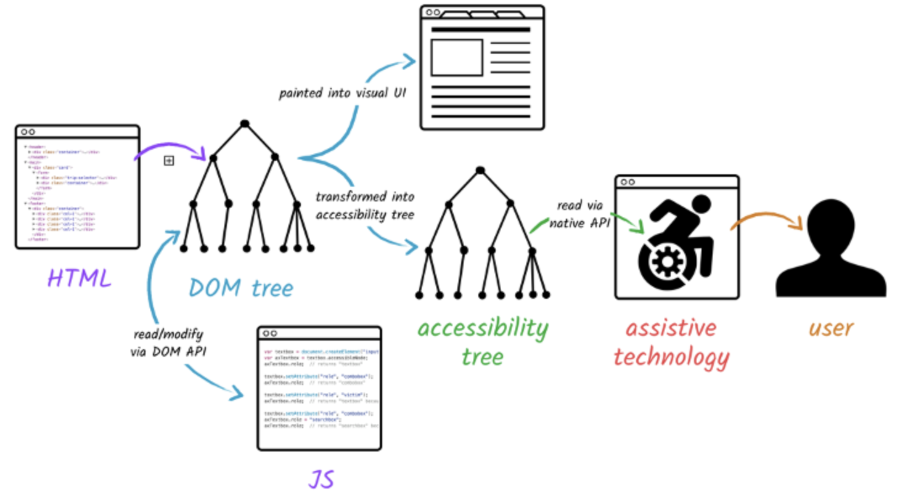

<table>
  <tr>
    <td></td>
    <th scope="col">DOM tree</th>
    <th scope="col">Accessibility tree</th>
  </tr>
  <tr>
    <th scope="row">Definition</th>
    <td>This is a programming interface that represents the structure and content of a web page as a hierarchical tree of objects. It contains all the elements, attributes, and text nodes of the HTML markup.</td>
    <td>This is a specialised tree derived from the DOM tree, containing accessibility-related information for most HTML elements.</td>
  </tr>
  <tr>
    <th scope="row">Purpose</th>
    <td>Represents the complete structure of a web page, used by browsers to render the page and by JavaScript to manipulate the content.</td>
    <td>Specifically designed to provide information to assistive technologies (like screen readers) about the structure, content, and functionality of a web page in a way that can be interpreted and presented to users with disabilities.</td>
  </tr>
  <tr>
    <th scope="row">Content</th>
    <td>Contains all elements and information from the HTML, including those that might not be relevant for accessibility.</td>
    <td>Contains a subset of the DOM, focusing on elements and properties that are relevant for accessibility. It may exclude purely visual elements or those without semantic meaning.</td>
  </tr>
  <tr>
    <th scope="row">Structure</th>
    <td>Mirrors the exact structure of the HTML document.</td>
    <td>May have a simplified structure, combining or omitting certain elements to present a more logical and understandable representation for assistive technologies.</td>
  </tr>
  <tr>
    <th scope="row">Properties</th>
    <td>Includes all properties and attributes of HTML elements.</td>
    <td>Focuses on accessibility-specific properties such as name, role, state, value and properties that are relevant to assistive technologies.</td>
  </tr>
  <tr>
    <th scope="row">API and platforms</th>
    <td>Consistent across browsers and platforms.</td>
    <td>Can vary between different platforms and accessibility APIs, as each platform may have its own way of representing and exposing accessibility information.</td>
  </tr>
</table>

## Visual workflow

