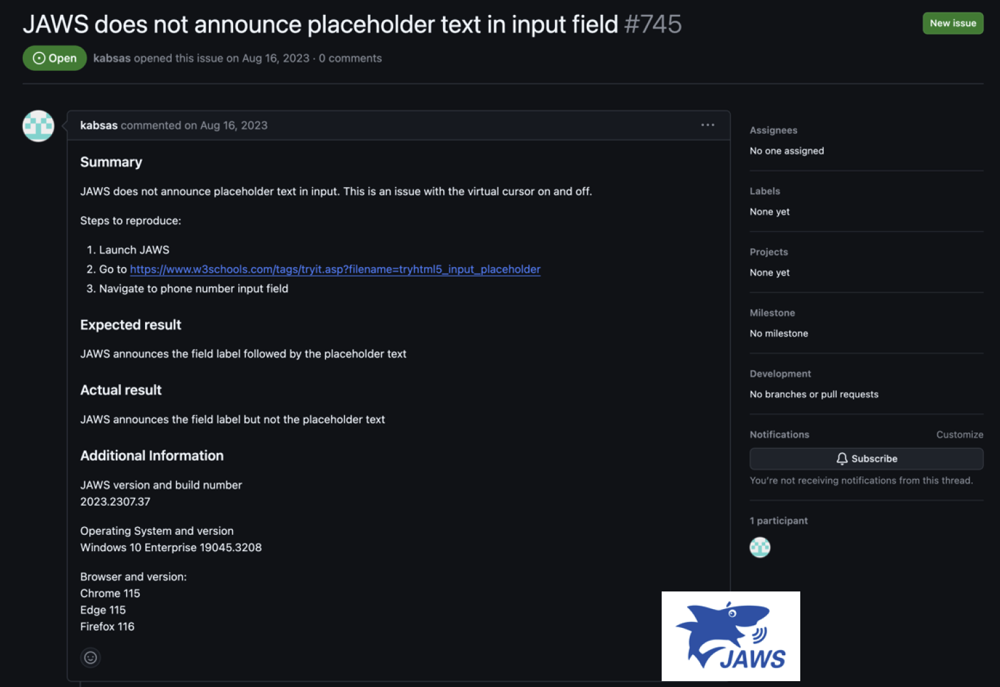

Forms are critical touchpoints for user interaction, serving as gateways for everything from simple sign-ups to complex
transactions. However, inaccessible forms create significant barriers for people with disabilities, potentially
excluding them from essential services and information.

## Labels

Labels provide the accessible name for the field to which it is programmatically associated.
If, for some reason, you don't want to show the label of a form field it should mention that the `<label>` element should be rendered but visually hidden to make sure that the semantic information is available.

To explicitly associate a `<label>` element with an `<input>` element, you first need to add the id attribute to the `<input>` element. Next, you add the for attribute to the `<label>` element, where the value of for is the same as the id in the `<input>` element.

```html
<label for="firstname">Firstname</label>
<input type="text" id="firstname" name="firstname" />
```

Alternatively, you can nest the `<input>` directly inside the `<label>`, in which case the for and id attributes are not needed because the association is implicit:

This is not a best practice since there is much less support for implicit association in this context, so always go for explicit association where possible.

```html
<label>
  <span>Firstname</span>
  <input type="text" name="firstname" />
</label>
```

## Placeholders

One of the most used screen readers according to Screen Reader Survey 10 is JAWS, and there is an issue that JAWS doesn't announce placeholder text in input.
So this means that you shouldn't rely on placeholder text to provide an accessible name for a form element.

[Github issue: JAWS does not announce placeholder text in input field](https://github.com/FreedomScientific/standards-support/issues/745)



## Instructions

In UX terms, this is referred to as the [Law of proximity](https://lawsofux.com/law-of-proximity/). This law states that "Objects that are near, or proximate to each other, tend to be grouped together.".

Since instructions must be rendered in proximity of the corresponding form field, a visual end user can rely on that information when filling in the form field.
Alternatively, there should be a kind of semantic association for non-visual users to provide them with the same information.

This can be accomplished through the help of ARIA, more specific `aria-describedby`. No other native mechanism is currently available to make a correct association.

:::note[Screen reader communication]
A screen reader will announce the firstname field as "Firstname, Edit text, This is the instruction below the firstname field" if the association is correctly implemented.
Otherwise it would just result in "Firstname, Edit text".
:::

```html
<!-- Bad -->
<label for="firstname">Firstname</label>
<input type="text" id="firstname" name="firstname" />
<p>This is the instruction below the firstname field</p>

<!-- Good -->
<label for="firstname">Firstname</label>
<input
  type="text"
  id="firstname"
  name="firstname"
  aria-describedby="firstname-instruction"
/>
<p id="firstname-instruction">
  This is the instruction below the firstname field
</p>
```

## Disabled and aria-disabled

Certainly regarding keyboard users, removing the ability to keyboard focus can lead to confusion. Via the disabled attribute, a dimmed layout is applied by default, but for people with visual impairments, that disabled state is not clear.

### Disabled

- Prevents total interaction with the element
- Removes element from tab sequence
- Is not clickable by pointer
- Is not reachable by touch

### Aria-disabled

- Doesn't prevent total interaction with the element
- Keeps element in tab sequence
- Is still clickable by pointer
- Moves focus to first invalid element within the form
