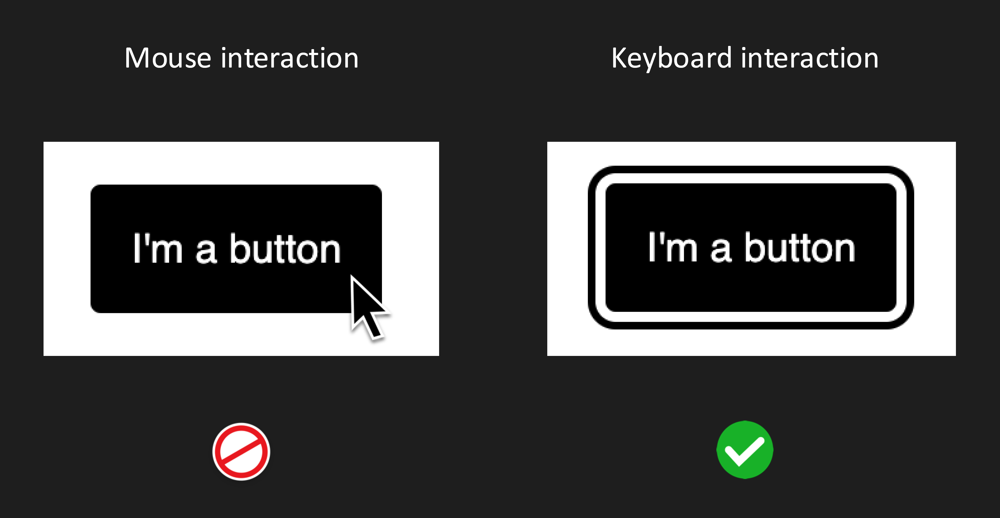

## Pointer events

Disabling pointer events will prohibit mouse interaction, while keyboard interaction is still available.
So consider keyboard-only users when making use of `pointer-events: none`.

## Hiding techniques

### Display none

- Will remove the entire element from the accessibility tree, which makes it inaccessible
- Also by reference, so referring to an element via aria-labelledby that is hidden by `display: none` will not provide an accessible name

### Visibility hidden

Same applies as for `display: none`.

### Aria hidden

Will remove the element from the accessibility tree, but will still be available visually.

### Visually hidden

Removes the element visually, but will still be available in the accessibility tree.
