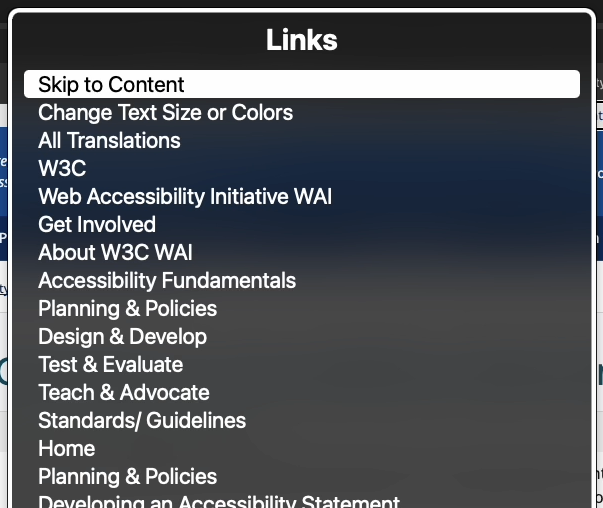

Learn the basics to get started using VoiceOver (Mac's and iOS's built-in screen reader)

## The rotor

This is a functionality within screen reader software. This rotor provides different navigation mechanisms
based on the semantic information within the page.

For example headings, form controls, landmarks, and links within VoiceOver, the screen reader on Mac and iOS: [Use the
VoiceOver rotor on Mac](https://support.apple.com/en-gb/guide/voiceover/mchlp2719/mac).

### Headings menu

The most used navigational pattern according to WebAIM research: <https://webaim.org/projects/screenreadersurvey10/#finding>.

### Links menu

### Form controls menu

### Landmarks menu

