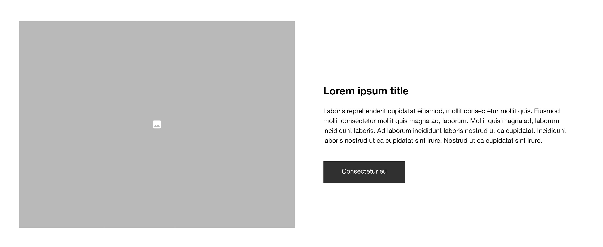
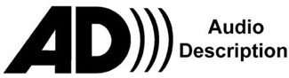
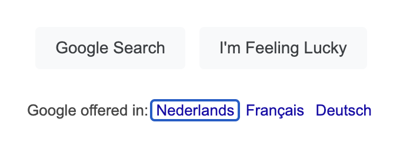

## Page structure

An essential part of taking accessibility into account when designing is providing structure and meaning.

As most of the designers use a component-based system, it is often neglected that each of these components need to
fit in the correct page structure. A component could contain one or multiple headings or other semantic information that
has impact on the overall page structure.

:::tip[WCAG Reference]
Success Criterion [1.3.1: Info and Relationships (Level A)](https://www.w3.org/TR/UNDERSTANDING-WCAG20/content-structure-separation-programmatic.html)
:::

### Technical hierarchy

For each page-level design is it advised to discuss structural semantics with a developer. As a designer you could
definitely make an initial proposal on how you see the heading structure.

:::tip[WCAG Reference]
Both technique [G141: Organizing a page using headings](https://www.w3.org/TR/WCAG20-TECHS/G141) and technique [H42:
Using h1-h6 to identify headings](https://www.w3.org/TR/WCAG20-TECHS/H42) can be referred to.
:::

#### Example outline

```html
<h1>About us</h1>
<h2>Contact information</h2>
<h3>Send us a message</h3>
<h3>Our location</h3>
<h2>FAQ</h2>
<h3>Nostrud ea id consectetur aute velit?</h3>
<h3>Sunt cillum mollit veniam in est duis duis?</h3>
<h3>Sed veniam quis exercitation mollit, ex sunt?</h3>
<h3>Anim nulla dolore, officia dolore id?</h3>
```

The most important thing to keep in mind is to limit a page to one `<h1>` element and make sure the `<h1>` accessible name
matches the `<title>` element's accessible name.

:::note
An accessible name is a short string, typically 1 to 3 words, that authors associate with an element to provide users of assistive technologies with a label for the element.
:::

The `<title>` element's content is preferably set to `[page-title] - [website-name]`, because this will provide the end
user with the most relevant information first.

Especially for screen reader users it is better to put the repetitive content at the end of the accessible naming,
because otherwise they have to listen to the repetitive part each time before getting to the relevant content.

#### Page title and h1

:::tip[WCAG Reference]
Success Criterion [2.4.2: Page titled (Level A)](https://www.w3.org/WAI/WCAG21/Understanding/page-titled.html)
:::

```html
<head>
  <title>About us - A11Y docs</title>
</head>
<main>
  <h1>About us</h1>
</main>
```

### Visual hierarchy

In addition to the technical structure, there is also the visual structure, where the different levels of headings are also given their visual representation.

Important here, for cognitive reasons, is to assign the same visual properties to the headings of the same sequence.

So, for example, it is not intended that a `<h3>` at the top of the page to have a font-size of 20px and a `<h3>` at the
bottom of the page to have a font-size of 24px.

So consistency is key.

### Visual order vs DOM order

When both the visual and technical hierarchy are in place, it is important to keep them in sync at all times as well.
At first, this may seem more like something for technical implementation, but it is important for designers to understand their impact on development.

In this section, I am referring to adjusting the visual order at different viewport breakpoints. If the visual order
changes we also need to keep the DOM (Document Object Model) order in sync at all times, so if you would decide to adjust visual order at some
breakpoints you should definitely do this in consultation with a developer.

:::tip[WCAG Reference]
Technique C27: [Making the DOM order match the visual order](https://www.w3.org/TR/WCAG20-TECHS/C27.html).
:::



Should you want to place the image below the text on mobile, at that point the visual order is out of sync with the DOM order, which will cause a diminished user experience.

So to bring both sequences (visual and DOM) back in sync, the rendering will also have to be adjusted, in other words a
separate rendering on mobile and on desktop.

## Text spacing

Line height, paragraph spacing, letter spacing, text alignment are all taking part in this section.

:::tip[WCAG Reference]
Success Criterion [1.4.12: Text Spacing (Level AA)](https://www.w3.org/WAI/WCAG21/Understanding/text-spacing.html)
:::

- Line height (line spacing) to at least 1.5 times the font size;
- Spacing following paragraphs to at least 2 times the font size;
- Letter spacing (tracking) to at least 0.12 times the font size;
- Word spacing to at least 0.16 times the font size.

:::caution[Justified text]
Justified text has a negative impact on people with a cognitive disability because the space between words is
inconsistent and in many cases too large.
:::

## Non-text content

Provide text alternatives for any non-text content so that it can be changed into other forms people need, such as large
print, braille, speech, symbols or simpler language.

The designer's job here is to use annotations in the design to indicate where and when the textual alternatives should be added.

Does the image have decorative value? Does the image carry information? Or is the image more likely to be used in a functional setting?

:::tip[WCAG Reference]
Success Criterion [1.1.1 Non-Text Content (Level A)](https://www.w3.org/WAI/WCAG21/Understanding/non-text-content.html).
:::

### Images

Images are part of the non-text content that may or may not have a textual alternative added depending on their behavior.

:::tip[WCAG Reference]
Technique G94: [Providing short text alternative for non-text content that serves the same purpose and presents the same
information as the non-text content](https://www.w3.org/TR/2016/NOTE-WCAG20-TECHS-20161007/G94).
:::

#### Informative images

Informative images provide information on their own. Meaning if an end user can't rely on the visual information that
the image provides, there is a textual alternative that describes the content of the image within its context.

In this case, you should add an alt description that describes the visual information with a maximum character length of
150 characters. All content should be written in sentences, so no list of keywords or buzzwords.

```html

```

#### Decorative images

Decorative images don't provide information on their own, they are solely used for decorative purposes.
This means that if you leave the decorative image out of their context, no information is lost.

In this case, you should add an empty alt description, thus `alt=""`.

```html

```

#### Functional images

Functional images differ at a certain level from the two previous types, they are used as (only) content of interactive
elements such as `<a>`, `<button>`, etc.

In this case, you should add an alt description that describes the purpose of the interactive element.

##### Anchors

For `<a>` elements, you describe where the end user will navigate to, such as:

```html
<a href="https://www.facebook.com/company">
  
</a>
```

##### Buttons

For `<button>` elements, you describe the action it will perform, such as:

```html
<button>
  
</button>
```

### Multimedia

:::tip[WCAG Reference]
All Success Criteria part of [1.2 Time-based
media](https://www.w3.org/WAI/WCAG21/Understanding/time-based-media#success-criteria), depending on the context of the multimedia.
:::

For multimedia, it is recommended that you use the checklist provided by Deque University.
Based on each scenario, this will help you decide which parts need extra attention.

The W3C resource provides similar information, but more written out. Deque their checklist is visually a bit more manageable.

- Deque University Web Accessibility Checklist: [Audio and video](https://dequeuniversity.com/checklists/web/audiovideo)
- W3C: [Making Audio and Video Media Accessible](https://www.w3.org/WAI/media/av/)

#### Text transcript

##### What is a transcript?

A text transcript should include all audible elements, which include: dialogue, important background sounds, music
identification, and more. They should also include a description of important visual-only elements. Many times there is
significant information displayed on screen that has no audio associated with it - characters' expressions, scenery
changes, implicit nonverbal communication between people, etc.

##### Why adding a transcript?

People who are both deaf and blind often use a refreshable braille display to read text output. While some of these
devices are technically compatible with captions, the captions move too quickly for many braille users. Thus, the
braille display would display lines of text too quickly, proving frustrating or even worse - completely useless. A text
transcript ensures that a person can progress through the information at their own pace.

##### How should I add a transcript?

You may be wondering what this has to do with design?

The reason why this is also a concern for a designer is because, as a designer, you have to build in the reflex to provide the right alternatives for multimedia as well, so also consider the different ways in which a transcript can be added:

- Provide the transcript on the same page as the video (make sure that it's easy to find, such as directly below the video).
- Provide a link to the transcript. That way, the page is not crowded with the transcript, but users can access it if they'd like. Again, ensure that it's easy to find (below the video is a good place).
- Provide an interactive transcript, such as the one available via the fully accessible, cross-browser media player, [Able Player](https://ableplayer.github.io/ableplayer/).

#### Audio description

Narration added to the soundtrack to describe important visual details that cannot be understood from the main
soundtrack alone. Audio description is a means to inform individuals who are blind or who have low vision about visual
content essential for comprehension.

Audio description of video provides information about actions, characters, scene
changes, on-screen text, and other visual content. Audio description supplements the regular audio track of a program.
Audio description is usually added during existing pauses in dialogue. Audio description is also called "video
description" and "descriptive narration".

You can always see audio description availability through this standardised icon.



:::tip[YouTube reference]
This YouTube video includes audio description as a configuration option: [Assassin's Creed Valhalla: [Audio Description]
Gameplay Overview | Ubisoft [NA]](https://youtu.be/p5S-LBTLFck?si=FsuT8Wk35r0kdYMT).
:::

#### (Closed) captions

##### What are captions?

Captions are necessary for deaf viewers to understand the content. Even if a captions track is available, ensure that it contains all meaningful information in the video, not just dialogue.

Deaf viewers can see everything in the video but are not able to hear any of it without captions. Without a caption
track, deaf viewers do not have a way of knowing the dialog, narration, or the essential sounds not spoken by people,
such as "dramatic instrumental music," applause, screams, or other sounds that set the scene, provide context, or give
meaning to the video.

:::note[Captions vs subtitles]
Subtitles generally include only dialog and narration where captions include a text description of all important background noises and other sounds, in addition to the text of all
dialog and narration.
:::

##### Closed vs open

Closed captions are optional text overlays that can be turned on or off by viewers, while open captions are permanently
embedded in the video and cannot be disabled.

## Contrast ratios

### Text contrast

The default contrast ratio for text against its background is 4.5 to 1 (4.5:1).

For large text, the contrast ratio is smaller, namely 3 to 1 (3:1).

:::tip[WCAG Reference]
Success Criterion [1.4.3 Contrast (Minimum) (Level AA)](https://www.w3.org/WAI/WCAG21/Understanding/contrast-minimum.html).
:::

Large text concerns 2 scenarios:

- Font-size is at least 24px
- Font-weight is bold and font-size is at least 18px

If either scenario occurs, the guideline for large text applies.

### Non-text contrast

The contrast for non-text content is 3 to 1 (3:1) against its background.

:::tip[WCAG Reference]
Success Criterion [1.4.11 Non-text Contrast (Level AA)](https://www.w3.org/WAI/WCAG21/Understanding/non-text-contrast.html).
:::

## Keyboard navigation

### Focus indicators

#### Introduction

The default color contrast of focus indicators is not consistent between browsers. Moreover, the default color can also conflict with the brand design guidelines.

In Chrome, for example, the default focus indicator is a 1px outline with the color #99c8ff, that color is named
`-webkit-focus-ring-color`.

```CSS
*:focus {
  outline: -webkit-focus-ring-color auto 1px;
}
```

Below is a screenshot of the native focus indicator within Chrome, which in many cases is inadequate in terms of digital accessibility.



#### Step 1: Level A criteria

:::tip[WCAG Reference]
Success Criterion [2.4.7: Focus Visible (Level A)](https://www.w3.org/WAI/WCAG21/Understanding/focus-visible).
:::

To meet the requirements of the "Focus Visible" criterion, it is necessary to have a visible focus indicator for components that are currently in keyboard focus.

Therefore, the initial action to take in order to create accessible focus indicators is to avoid hiding them.

Below is a screenshot of a hidden focus indicator, so as a keyboard user you cannot visually infer which element is active.


#### Step 2: Level AA criteria

:::tip[WCAG Reference]
Success Criterion [1.4.11 Non-Text Contrast (Level AA)](https://www.w3.org/WAI/WCAG21/Understanding/non-text-contrast.html).
:::

Focus indicators are used to identify a component state (focus). According to the "Non-Text Contrast" criterion, it is
necessary for focus indicators to exhibit a color contrast ratio of at least 3:1 when compared to adjacent colors.

It is important to note that the term "adjacent colors" here refers to the colors that connect to the focus indicator and not to the component that is in a focused state.

So the contrast ratio depends on the color ánd position of the focus indicator.

:::tip[WCAG Reference]
Success Criterion [2.4.11 Focus Not Obscured (Minimum) (Level AA)](https://www.w3.org/WAI/WCAG22/Understanding/focus-not-obscured-minimum).
:::

This criterion means making sure the user can actually see the element or component they are targeting by making sure it is not hidden behind other content on the page.

However, according to this criterion, the component must not be completely hidden. This means that it can be partially hidden, as long as it remains partially visible.

Despite the letter of the law, it is still always a best practice to make the focus indicator fully visible. Elements
that are partially hidden is generally inadvisable when your goal is to ensure maximum usability.

#### Conclusion

The best approach to design a focus indicator is to use a 3px solid outline or border, preferably with an offset of 4px.

As for the color, you are free to choose, just keep in mind the 3:1 contrast ratio against the background of the focus
indicator. Especially people with a visual impairment need sufficient contrast, for example: Low vision.

```CSS
*:focus {
  outline-color: #000;
  outline-style: solid;
  outline-width: 3px;
  outline-offset: 4px;
}
```

If you want to make a distinction between keyboard focus indicator design and mouse/tap focus indicator design, you can! A
developer needs to use the `:focus-visible` selector instead of the `:focus` selector.

:::note[Keyboard-only focus indicator]
Today, all modern browsers only show the default focus indicators when they are needed: when navigating the page with a
keyboard. The focus outline doesn't show up when you click or tap an element; it only shows up when you tab to it with a
keyboard.
:::

So if you provide a custom focus indicator design, it is important to continue that same line as modern browsers do, using `:focus-visible`.

### Focus order

## Screen readers

The purpose of a screen reader is to assist individuals with visual impairments or learning/reading difficulties in accessing and interacting with digital content. A screen reader is a software application that uses text-to-speech technology to read aloud the text on a computer screen.

### Overview

#### Desktop

- [Desktop Screen Readers Survival Guide - Basic Keyboard Shortcuts](https://dequeuniversity.com/screenreaders/survival-guide)
- [Desktop Screen Readers Forms Guide](https://dequeuniversity.com/screenreaders/forms-guide)

#### Windows

- [NVDA Keyboard Shortcuts](https://dequeuniversity.com/screenreaders/nvda-keyboard-shortcuts)
- [JAWS Keyboard Shortcuts](https://dequeuniversity.com/screenreaders/jaws-keyboard-shortcuts)
- [Narrator Keyboard Shortcuts](https://dequeuniversity.com/screenreaders#:~:text=Narrator%20Keyboard%20Shortcuts)
- [JAWS Keyboard Shortcuts for Word](https://dequeuniversity.com/screenreaders/jaws-word)

#### Mac

- [VoiceOver Keyboard Shortcuts on a Mac](https://dequeuniversity.com/screenreaders/voiceover-keyboard-shortcuts)
- [Enabling Keyboard Accessibility on a Mac](https://dequeuniversity.com/mac/keyboard-access-mac)
- [Using Windows Screen Readers on a Mac](https://dequeuniversity.com/mac/windows-screen-readers)

#### Mobile

- [TalkBack Gestures on Android](https://dequeuniversity.com/screenreaders/talkback-shortcuts)
- [VoiceOver Gestures on iOS](https://dequeuniversity.com/screenreaders/voiceover-ios-shortcuts)

### Screen reader modes

Screen readers have different modes that cater to specific situations. The two primary categories of circumstances are as follows:

1. Browse mode (page navigation): This mode allows users to navigate within a document using various keystrokes for different tasks. For instance, pressing "H" can help navigate to headings, "G" to graphics, and "T" to tables. This mode is also known as scan mode (in Narrator), browse mode, or document mode.

2. Forms mode (Input or interaction): In this mode, users interact with elements (such as text fields or custom
   JavaScript widgets), it is important to note that certain keystrokes used for page navigation, like "H" for headings,
   are disabled in this mode to avoid any conflicts. This mode may have different names, including forms mode, focus
   mode, or application mode

#### Browse mode

Reading text
In document mode, or reading mode, screen reader users are able to read text, navigate by words, navigate by characters to hear the spelling of
words, and so on. This is the default mode of most screen readers.
Navigating by semantic elements
When users want to navigate by semantic elements (such as headings, landmarks, tables, graphics, lists, links, etc), they can use the screen
reader's keyboard shortcuts to go forward or backward through those elements.
In JAWS and NVDA, document mode or reading mode is the same mode that allows them to navigate by semantic elements.
In Narrator, users need to enter into "Scan Mode" (by pressing Caps lock + Space bar) to navigate by semantic elements.
In VoiceOver

#### Forms mode

When in a text field in a form, users want to be able to type text in the form field. Screen readers need to disable all of the keyboard shortcuts
associated with letters and numbers in order to allow users to type text. If you are using
[JAWS](https://www.freedomscientific.com/products/software/jaws/), for example, the H key normally takes you to the next
heading.

But when typing in a form field, you don't want to go to the next heading. You want to type the letter H. To make that possible, JAWS
automatically switches from document to forms mode, disabling the normal keyboard shortcuts to allow you to type the letters and numbers.
When typing in a text field in forms mode, screen readers will speak the letter being typed (e.g.
"H") and allow the character to be typed.

Screen readers generally switch over to forms mode automatically as soon as you put the focus on a form field by tabbing into it. Forms mode is not
activated when simply reading through the content of a form in regular reading mode or document mode. In other words, the `<form>` tag itself does
not trigger forms mode. You have to put the keyboard focus on a form field (a text `<input>`, a `<select>` menu, a `<textarea>`, a radio button, etc.) to
trigger forms mode.

Some screen readers allow users to manually toggle between forms mode and document mode. In
[NVDA](https://www.nvaccess.org/download/), for example, the keystroke is Insert + Space bar.

### Reserved interactions

#### Carousels

A common aspect is the use of a slider/carousel to maximize horizontal space when vertical space must be limited.

On mobile, swipe gestures are commonly used to navigate through the carousel, quickly omitting the previous and next
buttons. Important to note here is that screen readers in a mobile context employ swipe gestures to navigate through the page.

With [TalkBack (Android)](https://appt.org/en/docs/android/features/talkback), for example, you have the following interactions as an alternative to keyboard navigation:

- Swipe right with 1 finger to go to the next element
- Swipe left with 1 finger to go to the previous element
- Swipe left, right, up, or down with 2 fingers to scroll in that direction

With [VoiceOver (iOS)](https://appt.org/en/docs/ios/features/voiceover), you have similar (reserved) interactions through swiping:

- Swipe right to select the next item
- Swipe left to select the previous item
- Two-finger swipe right to move into a group of items
- Two-finger swipe left to move out of a group of items

## Forms

### Labels

Labels provide the accessible name for the field to which it is programmaticaly associated.
If, for some reason, you don't want to show the label of a form field it should mention that the `<label>` element
should be rendered but visually hidden to make sure that the semantic information is available.

### Form validation

- Inline validation close to the corresponding field.
- Error summary on top of the form contains a number of errors and links that bring the (keyboard) user to the relevant field.

### Error suggestion

- If an error is shown, provide sufficient information for the end user to provide the correct input.

## Links

- Underline to make a visual distinction between default text and links, not by color alone.
- Use links for navigation, by id or by url
- Don't use links for functional purpose, such as: `<a href="#">`. Use a `<button>` instead.

## Fonts

Serif vs sans-serif, dyslexia fonts, etc.
